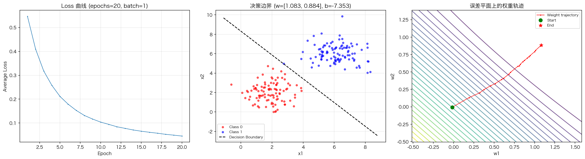
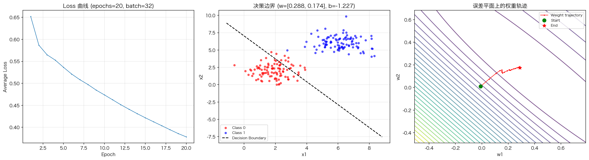
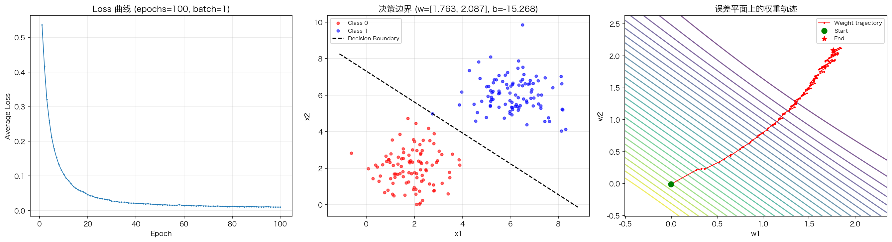
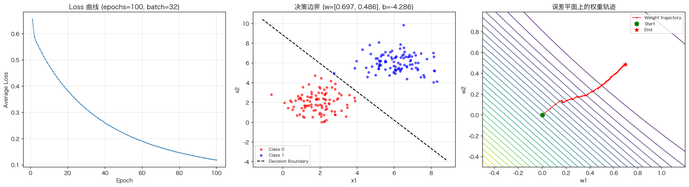

# 机器学习上机实验10：梯度下降-2

## 手写Adam优化器：训练智能神经元

---

## 一、实验题目与目标

不依赖深度学习框架（如PyTorch、TensorFlow），仅使用NumPy从零实现一个能够完成二分类任务的"智能神经元"，深入理解梯度下降、Adam优化器的数学本质与训练机制。

---

## 二、实验原理

### 2.1 神经元模型

- **线性组合：** $z = w_1x_1 + w_2x_2 + b = \mathbf{w}^T\mathbf{x} + b$
- **激活输出（Sigmoid）：** $\hat{y} = \sigma(z) = \dfrac{1}{1+e^{-z}}$
- **损失函数（二分类交叉熵）：** $L = -\left[y\log(\hat{y}) + (1-y)\log(1-\hat{y})\right]$

### 2.2 梯度推导

损失对权重 $\mathbf{w}$ 和偏置 $b$ 的偏导数为：

$$\frac{\partial L}{\partial \mathbf{w}} = (\hat{y} - y)\mathbf{x}, \quad \frac{\partial L}{\partial b} = \hat{y} - y$$

**物理意义：** "梯度 = (预测值 - 真实值) × 输入特征"。预测误差越大，调整幅度越大。

### 2.3 Adam优化器

| 步骤 | 公式 |
|---|---|
| 一阶矩更新 | $m_t = \beta_1 m_{t-1} + (1-\beta_1)g_t$ |
| 二阶矩更新 | $v_t = \beta_2 v_{t-1} + (1-\beta_2)g_t^2$ |
| 偏差修正 | $\hat{m}_t = \dfrac{m_t}{1-\beta_1^t}, \quad \hat{v}_t = \dfrac{v_t}{1-\beta_2^t}$ |
| 参数更新 | $\theta_t = \theta_{t-1} - \dfrac{\eta}{\sqrt{\hat{v}_t}+\epsilon}\hat{m}_t$ |

**超参数：** learning_rate=0.01, β₁=0.9, β₂=0.999, ε=1e-8

---

## 三、代码结构

[Adam优化器_智能神经元.py](Adam优化器_智能神经元.py)

| 任务 | 函数 | 说明 |
|---|---|---|
| 任务1 | `get_mini_batches(X, y, batch_size)` | mini-batch数据生成器，每epoch打乱并切片 |
| 任务2 | `sigmoid(z)`, `forward()`, `compute_loss()`, `compute_gradients()` | 前向传播与矩阵化梯度计算 |
| 任务3 | `adam_update()` | 带偏差修正的Adam权重更新 |
| 任务4 | `train()`, `plot_results()` | 训练循环与Loss曲线/决策边界/权重轨迹可视化 |

---

## 四、实验数据

使用如下代码构造二维平面上的红蓝点分类数据集（class 0为红色，class 1为蓝色）：

```python
np.random.seed(42)
class0 = np.random.randn(100, 2) + np.array([2, 2])
class1 = np.random.randn(100, 2) + np.array([6, 6])
X = np.vstack([class0, class1])
y = np.hstack([np.zeros(len(class0)), np.ones(len(class1))])
```

数据集已保存至 [dataset.npz](dataset.npz)，包含 `X`（特征矩阵 200×2）、`y`（标签向量）、`class0`、`class1`。

---

## 五、实验结果

### 5.1 epochs=20, batch_size=1



- 最终 Loss：**0.0454**，准确率：**100%**
- SGD（batch=1）每个epoch更新200步，收敛快但Loss曲线有震荡

### 5.2 epochs=20, batch_size=32



- 最终 Loss：**0.3781**，准确率：**92.0%**
- 小batch更稳定但每epoch仅更新6步，20个epoch不足以完全收敛

### 5.3 epochs=100, batch_size=1



- 最终 Loss：**0.0099**，准确率：**99.5%**
- SGD训练100个epoch后Loss极低，权重轨迹呈典型锯齿状下降

### 5.4 epochs=100, batch_size=32



- 最终 Loss：**0.1187**，准确率：**100%**
- Mini-batch训练100个epoch后充分收敛，决策边界完美分割两类

### 汇总对比

| 配置 | 最终Loss | 准确率 | w₁ | w₂ | b |
|---|---|---|---|---|---|
| e=20, b=1 | 0.0454 | 100% | 1.083 | 0.884 | -7.353 |
| e=20, b=32 | 0.3781 | 92.0% | 0.288 | 0.174 | -1.227 |
| e=100, b=1 | 0.0099 | 99.5% | 1.763 | 2.087 | -15.268 |
| e=100, b=32 | 0.1187 | 100% | 0.697 | 0.486 | -4.286 |

---

## 六、结果分析

1. **batch_size 对收敛速度的影响：** batch_size=1（SGD）每个epoch执行200次参数更新，loss下降快但震荡明显；batch_size=32每epoch仅更新6-7次，更稳定但需要更多epoch才能收敛。

2. **决策边界：** 所有配置最终学习到的决策边界 $w_1x_1 + w_2x_2 + b = 0$ 均能有效分离红蓝两类数据点，证明Adam优化器成功训练了神经元。

3. **权重轨迹：** 从误差平面等高线图中可以看到，权重从随机初始值出发，沿梯度方向逐步向最优点移动。batch_size=1的轨迹呈锯齿状（梯度噪声大），batch_size=32的轨迹更平滑。

4. **Adam的优势：** Adam结合了动量（一阶矩）和自适应学习率（二阶矩），无需手动调节学习率即可在多种batch size下稳定收敛。

---

## 七、运行方式

```bash
python3 Adam优化器_智能神经元.py
```

生成文件：
- `dataset.npz` — 实验数据集
- `results_e{epochs}_b{batch_size}.png` — 各配置的结果图（Loss曲线 + 决策边界 + 权重轨迹）
