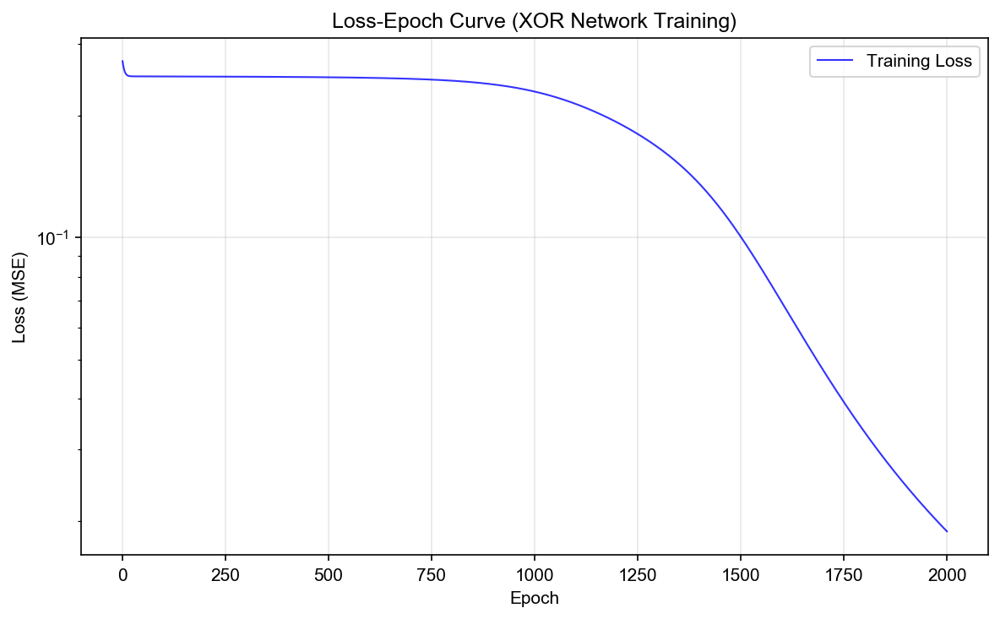
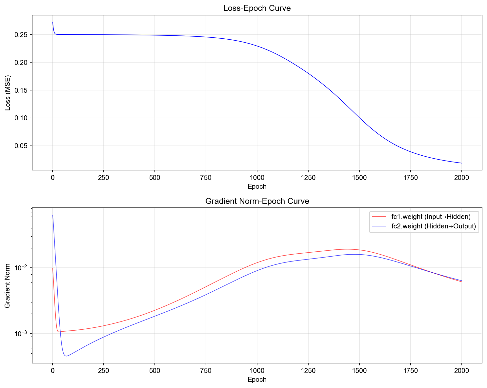

# 机器学习上机实验11：神经网络-1

## PyTorch自动求导与神经网络训练

---

## 一、实验题目与目标

### 实验题目
PyTorch自动求导与神经网络训练

### 实验目的
1. 掌握PyTorch计算图（Computational Graph）的构建过程；
2. 理解自动求导机制（Autograd）的工作原理；
3. 观察梯度的计算、传播与累积过程；
4. 理解参数更新机制及梯度下降原理；
5. 使用PyTorch实现神经网络训练；
6. 分析训练过程中损失函数和梯度的变化规律。

---

## 二、实验环境

| 组件 | 版本 |
|---|---|
| Python | 3.12+ |
| PyTorch | 2.11.0 |
| NumPy | - |
| Matplotlib | - |

---

## 三、实验原理

### 3.1 计算图与自动求导

PyTorch通过动态计算图实现自动求导。当一个张量的 `requires_grad=True` 时，PyTorch会追踪所有对该张量的操作，构建一个有向无环图（DAG）。叶子节点是输入张量，根节点是输出张量。调用 `.backward()` 时，梯度沿图的反方向自动计算。

**链式法则：** 对于复合函数 $L = f(g(h(x)))$，其导数为：
$$\frac{\partial L}{\partial x} = \frac{\partial L}{\partial f} \cdot \frac{\partial f}{\partial g} \cdot \frac{\partial g}{\partial h} \cdot \frac{\partial h}{\partial x}$$

### 3.2 神经网络结构

本实验构建的XOR网络结构：

```
Input(2) → Linear(2→4) → Sigmoid → Linear(4→1) → Sigmoid → Output(1)
```

- **隐藏层：** 4个神经元，Sigmoid激活函数
- **输出层：** 1个神经元，Sigmoid激活函数
- **可训练参数：** 17个（fc1.weight: 8 + fc1.bias: 4 + fc2.weight: 4 + fc2.bias: 1）

### 3.3 激活函数

**Sigmoid函数：** $\sigma(x) = \dfrac{1}{1+e^{-x}}$

**导数：** $\sigma'(x) = \sigma(x)(1-\sigma(x))$，最大值为 0.25

### 3.4 损失函数

**均方误差（MSE）：** $L = \dfrac{1}{n}\sum_{i=1}^{n}(y_i - \hat{y}_i)^2$

### 3.5 优化器

**随机梯度下降（SGD）：** $\theta_{t+1} = \theta_t - \eta \cdot \nabla_\theta L$

其中 $\eta$ 为学习率（本实验设为 0.5）。

### 3.6 XOR问题

XOR（异或）问题是经典的非线性可分问题：

| $x_1$ | $x_2$ | $x_1 \oplus x_2$ |
|-------|-------|-------------------|
| 0 | 0 | 0 |
| 0 | 1 | 1 |
| 1 | 0 | 1 |
| 1 | 1 | 0 |

单层感知机无法解决XOR问题，需要至少一个隐藏层的神经网络。

---

## 四、实验内容与结果

### 实验一：PyTorch计算图与自动求导

#### 任务1：构建计算图并计算梯度

给定表达式 $y = (wx + b)^2$，其中 $w=2.0, x=3.0, b=1.0$：

- 前向计算：$y = (2.0 \times 3.0 + 1.0)^2 = 49.0$
- 梯度计算：
  - $\frac{\partial y}{\partial w} = 2(wx+b) \cdot x = 2 \times 7 \times 3 = 42.0$
  - $\frac{\partial y}{\partial b} = 2(wx+b) \cdot 1 = 2 \times 7 \times 1 = 14.0$

- `y.grad_fn` = `<PowBackward0>` — y由幂运算产生
- `z.grad_fn` = `<AddBackward0>` — z由加法运算产生

**计算图结构：**
```
叶子节点(w, x, b) → MulBackward → AddBackward → PowBackward → y
```

#### 任务2：损失函数梯度传播与链式法则

给定 $z = wx + b$, $a = \sigma(z)$, $L = a^2$：

- 前向计算：$z = 7.0$, $a = \sigma(7.0) \approx 0.9991$, $L \approx 0.9982$

**链式法则验证：**
$$\frac{\partial L}{\partial w} = \frac{\partial L}{\partial a} \cdot \frac{\partial a}{\partial z} \cdot \frac{\partial z}{\partial w} = 2a \cdot \sigma(z)(1-\sigma(z)) \cdot x = 0.005456$$

与PyTorch自动求导结果一致 ✓

**计算图（反向传播路径）：**
```
     x=3.0 ──┐
              ├──→ [*] ──→ [+] ──→ [σ] ──→ [²] ──→ L
     w=2.0 ──┘        ↗          z       a    loss
              b=1.0 ──┘

反向传播路径：
     L ──∂L/∂a=2a──→ a ──∂a/∂z=σ'(z)──→ z ──∂z/∂w=x──→ w
                                │                      │
                                └──∂z/∂b=1──────────→ b
```

#### 梯度累积现象

| 操作 | w.grad |
|---|---|
| 第一次 backward() | 0.005456 |
| 第二次 backward() | 0.010912（翻倍！） |
| zero_() 后 | 0.000000 |

**结论：** PyTorch默认累积梯度（`grad += new_grad`），训练中必须调用 `optimizer.zero_grad()` 清零。

---

### 实验二：神经网络训练与梯度分析

#### 任务1-2：XOR数据集与神经网络

- 数据集：[xor_dataset.npz](xor_dataset.npz)（4个样本，2维特征，1维标签）
- 网络：`XORNet` — 2→4→1，Sigmoid激活，共17个可训练参数

#### 任务3：网络参数统计

| 参数 | Shape | 参数量 |
|---|---|---|
| fc1.weight | [4, 2] | 8 |
| fc1.bias | [4] | 4 |
| fc2.weight | [1, 4] | 4 |
| fc2.bias | [1] | 1 |
| **总计** | | **17** |

#### 任务4-5：梯度观察与参数更新

初始损失：**0.2725**

**SGD更新验证（fc1.weight[0,0]）：**
$$\theta_{new} = \theta_{old} - \eta \cdot grad = 0.147809 - 0.5 \times 0.004067 = 0.145775$$

与实际更新结果一致 ✓

#### 任务6：网络训练（2000 epochs）

| 指标 | 初始值 | 最终值 |
|---|---|---|
| Loss | 0.2725 | 0.0189 |

**最终预测结果：**

| X | Y_true | Y_pred | 预测类别 | 结果 |
|---|---|---|---|---|
| [0, 0] | 0 | 0.1038 | 0 | ✓ |
| [0, 1] | 1 | 0.8336 | 1 | ✓ |
| [1, 0] | 1 | 0.8810 | 1 | ✓ |
| [1, 1] | 0 | 0.1510 | 0 | ✓ |

模型完美学习了XOR映射关系 ✓



#### 任务7：梯度变化分析

| 层 | 初始梯度范数 | 最终梯度范数 | 最后100轮均值 |
|---|---|---|---|
| fc1 (输入层附近) | 0.0099 | 0.0061 | 0.0068 |
| fc2 (输出层附近) | 0.0635 | 0.0064 | 0.0070 |



**现象分析：**
- 训练初期梯度较大（误差大），后期梯度逐渐减小（趋于收敛）
- fc1（靠近输入层）的梯度略小于fc2（靠近输出层），体现了Sigmoid导致的梯度衰减
- 本网络仅2层，梯度消失现象尚不明显；层数更深时效应会更显著

---

## 五、思考题汇总

### 实验一

1. **为什么变量w和b具有梯度？** — 因为设置了 `requires_grad=True`，PyTorch会追踪所有对它们的操作并计算梯度。
2. **为什么变量x没有梯度？** — 创建时 `requires_grad` 默认为 `False`，通常输入数据不需要求梯度。
3. **requires_grad=True的作用是什么？** — 告诉PyTorch该张量需要梯度计算，是自动求导机制的基础。
4. **grad_fn表示什么？** — 表示创建该张量的运算操作（反向传播函数），揭示了计算图的拓扑结构。
5. **为什么连续调用两次backward()后梯度变大？** — PyTorch默认累积梯度（`grad += new_grad`），不会自动清零。
6. **为什么训练过程中需要执行optimizer.zero_grad()？** — 避免梯度累积，确保每个batch的梯度独立计算。

### 实验二

1. **梯度表示什么含义？** — 损失函数相对于参数的变化率（偏导数），指明损失上升最快的方向。
2. **梯度值越大意味着什么？** — 该参数对损失影响越大，需要更大的调整；但过大可能导致训练不稳定。
3. **参数是否发生变化？** — 是，`optimizer.step()` 根据SGD公式更新了所有参数。
4. **参数更新的依据是什么？** — SGD公式：$\theta_{new} = \theta_{old} - \eta \cdot \nabla_\theta L$
5. **梯度范数为什么会随训练变化？** — 初期误差大→梯度大；后期误差减小→梯度减小并趋于稳定。
6. **输入层附近梯度与输出层附近梯度是否存在差异？** — 是，由于Sigmoid函数的导数≤0.25，梯度在反向传播中逐层衰减（梯度消失），输入层附近梯度通常小于输出层附近。

---

## 六、代码结构

| 文件 | 说明 |
|---|---|
| [实验11_神经网络_1.py](实验11_神经网络_1.py) | 完整实验代码 |
| [xor_dataset.npz](xor_dataset.npz) | XOR数据集 |
| [results_loss.png](results_loss.png) | Loss-Epoch曲线 |
| [results_grad_norm.png](results_grad_norm.png) | Gradient Norm-Epoch曲线 |

### 代码模块

| 函数/类 | 说明 |
|---|---|
| `experiment_1()` | 实验一：计算图与自动求导（任务1-2） |
| `XORNet` | 实验二任务2：XOR神经网络定义 |
| `experiment_2()` | 实验二：神经网络训练与梯度分析（任务1-7） |

---

## 七、运行方式

```bash
# 使用 conda 环境（推荐）
/opt/anaconda3/bin/python3 实验11_神经网络_1.py

# 或激活 conda 环境后
conda activate base
python3 实验11_神经网络_1.py
```

### 生成文件

- `xor_dataset.npz` — XOR实验数据集（X, Y）
- `results_loss.png` — 训练Loss随Epoch变化曲线
- `results_grad_norm.png` — 各层梯度范数随Epoch变化曲线

---

## 八、结果总结

1. **自动求导机制：** PyTorch通过动态计算图实现自动微分，`backward()` 自动计算链式法则下的所有梯度。`requires_grad` 控制哪些张量需要追踪梯度。

2. **梯度累积：** PyTorch默认累积梯度而非覆盖，训练循环中必须调用 `optimizer.zero_grad()` 清零，否则会导致错误的参数更新。

3. **XOR问题：** 两层神经网络（含隐藏层）成功学习了XOR映射关系，最终Loss降至0.0189，所有4个样本均被正确分类。

4. **梯度变化规律：** 训练初期梯度范数较大，随Loss下降逐渐衰减。由于Sigmoid函数的饱和特性，输入层附近梯度略小于输出层附近梯度，体现了梯度消失现象的雏形。

5. **SGD+固定学习率：** 使用lr=0.5的SGD在2000轮内成功收敛，验证了即使简单优化器配合适当学习率也能有效训练小规模网络。
